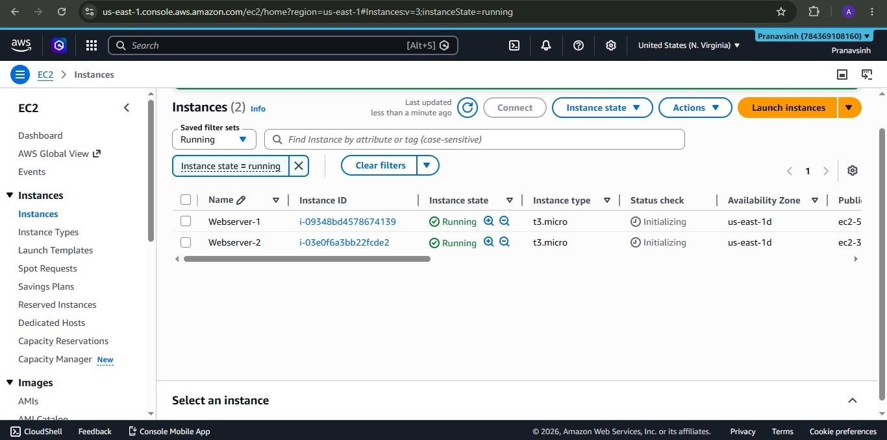
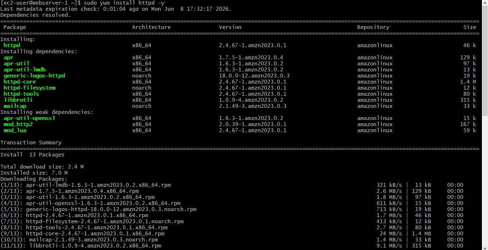
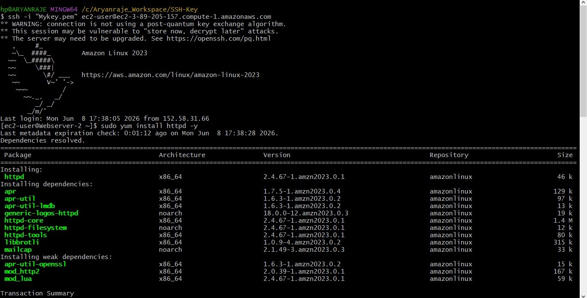
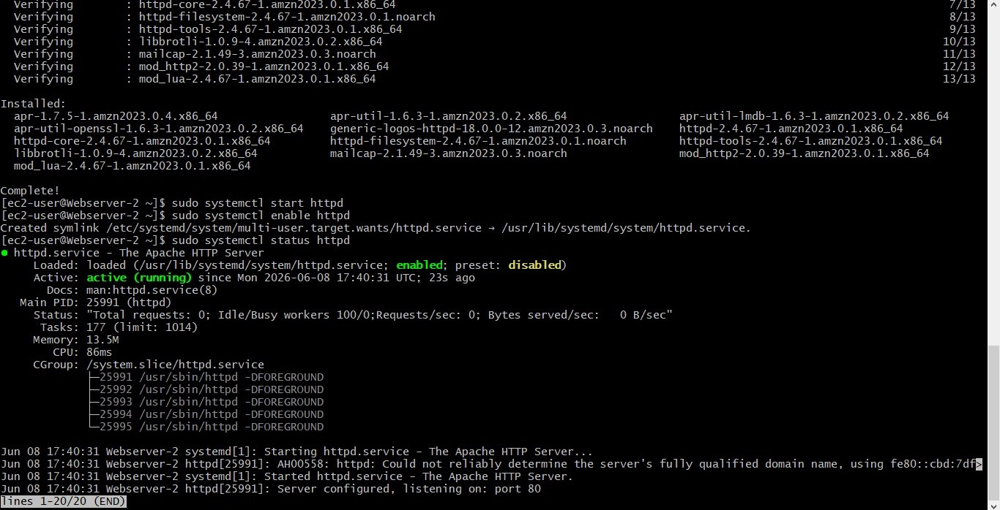
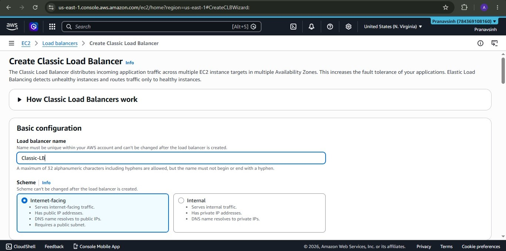
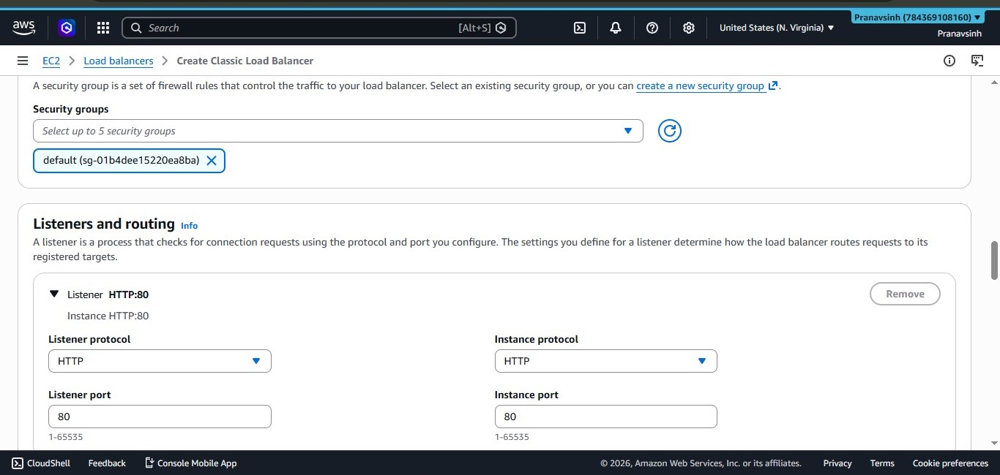
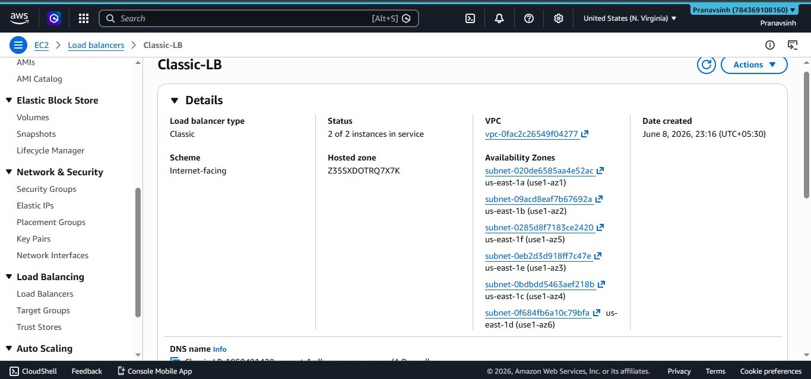
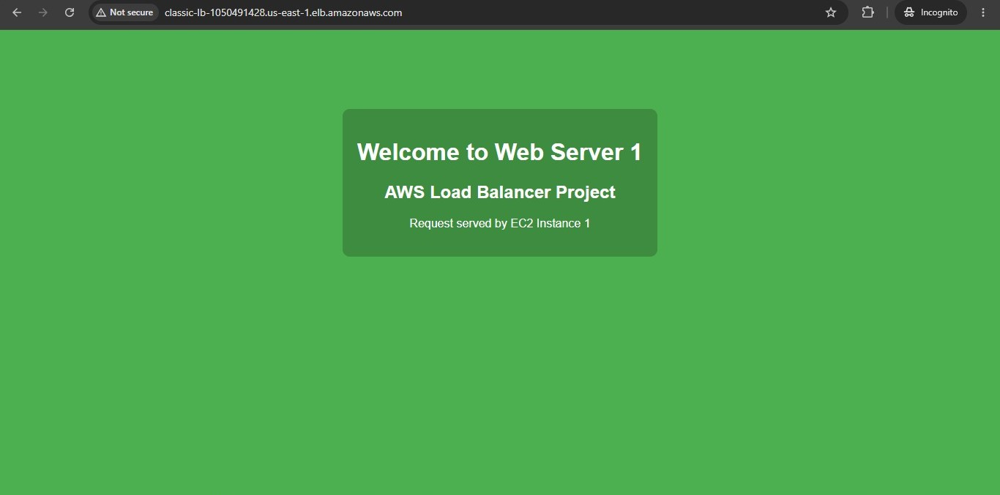
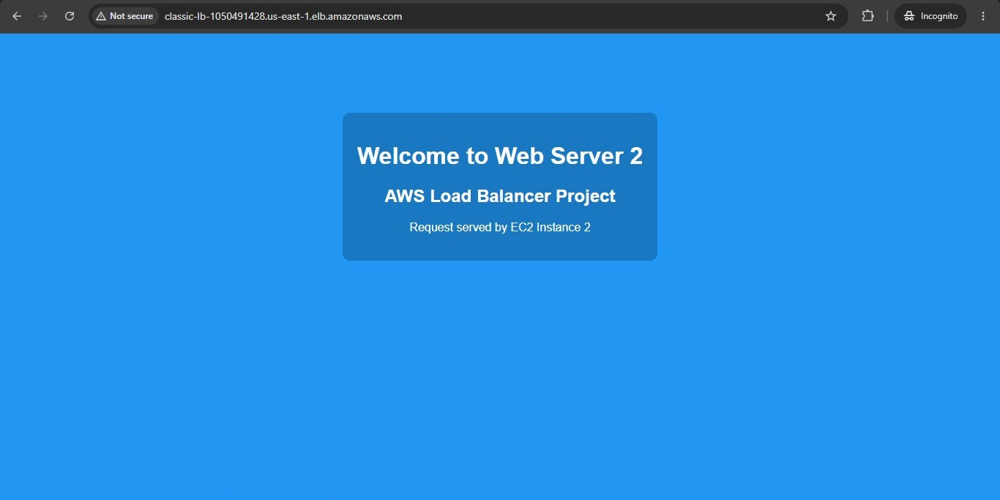

# AWS Classic Load Balancer Project

A hands-on AWS project demonstrating how to set up a **Classic Load Balancer** that distributes HTTP traffic across two Apache web servers running on EC2 instances in the `us-east-1` region.

---

## 📌 Project Overview

This project covers:
- Launching two EC2 instances (Webserver-1 and Webserver-2)
- Installing and configuring Apache HTTP Server (`httpd`) on both instances
- Creating custom `index.html` pages on each server to identify which instance is serving the request
- Setting up an AWS Classic Load Balancer (CLB) to distribute traffic between both servers
- Verifying that the load balancer correctly alternates between both web servers

---

## 🏗️ Architecture

```
                        Internet
                           |
                    [Classic Load Balancer]
                    classic-lb-*.us-east-1.elb.amazonaws.com
                     /                    \
           [Webserver-1]              [Webserver-2]
           EC2 t3.micro               EC2 t3.micro
           us-east-1d                 us-east-1d
           Apache HTTP                Apache HTTP
```

---

## 🛠️ Technologies Used

- **AWS EC2** — t3.micro instances (Amazon Linux 2023)
- **AWS Classic Load Balancer (CLB)**
- **Apache HTTP Server** (`httpd` 2.4.67)
- **SSH / Git Bash** — for remote instance access
- **HTML / CSS** — custom web pages per instance

---

## 📸 Screenshots

### 1. EC2 Instances Running
Both `Webserver-1` and `Webserver-2` are launched and in **Running** state.



---

### 2. Installing Apache on Webserver-1
Apache (`httpd`) installed via `sudo yum install httpd -y` on Webserver-1.



---

### 3. Installing Apache on Webserver-2
Same Apache installation performed on Webserver-2 via SSH.



---

### 4. Apache Service Active on Webserver-2
Apache service started, enabled on boot, and confirmed **active (running)**.



---

### 5. Creating Custom index.html
Navigated to `/var/www/html/` and created a custom `index.html` using `vim` to identify the server.


---

### 6. Creating the Classic Load Balancer
Created a Classic Load Balancer named `Classic-LB` with **Internet-facing** scheme.



---

### 7. Listener Configuration
Configured the load balancer listener on **HTTP port 80**, forwarding to instances on **HTTP port 80**.



---

### 8. Load Balancer Details — 2/2 Instances In Service
Load balancer is active with **2 of 2 instances in service**, spanning multiple Availability Zones.



---

### 9. Response from Web Server 1
Accessing the load balancer DNS routes to **Web Server 1** (green page).



---

### 10. Response from Web Server 2
Refreshing routes to **Web Server 2** (blue page) — confirming load balancing is working.



---

## 🚀 Steps to Reproduce

### Step 1 — Launch EC2 Instances
1. Go to **EC2 → Instances → Launch Instances**
2. Launch 2 instances with:
   - AMI: Amazon Linux 2023
   - Instance type: `t3.micro`
   - Name: `Webserver-1` and `Webserver-2`
   - Security group: Allow **HTTP (port 80)** and **SSH (port 22)**

### Step 2 — Install Apache on Both Instances
SSH into each instance and run:
```bash
sudo yum install httpd -y
sudo systemctl start httpd
sudo systemctl enable httpd
sudo systemctl status httpd
```

### Step 3 — Create Custom Web Pages
On **Webserver-1**:
```bash
cd /var/www/html/
sudo vim index.html
```
Add HTML content identifying the server (e.g., "Welcome to Web Server 1").

Repeat on **Webserver-2** with different content/color.

The index.html files used in this project are saved in the [`Index Files/`](Index%20Files/) folder.

### Step 4 — Create Classic Load Balancer
1. Go to **EC2 → Load Balancers → Create Load Balancer**
2. Select **Classic Load Balancer**
3. Configure:
   - Name: `Classic-LB`
   - Scheme: `Internet-facing`
   - Listener: HTTP:80 → HTTP:80
   - Security Group: default (or custom allowing port 80)
4. Add both EC2 instances as targets
5. Configure health check on `/index.html`

### Step 5 — Test the Load Balancer
Copy the **DNS name** from the load balancer details page and open it in a browser.  
Refresh multiple times — you should see responses alternating between **Web Server 1** and **Web Server 2**.

---

## ✅ Result

The Classic Load Balancer successfully distributes incoming HTTP traffic between two EC2 web servers. Refreshing the load balancer URL alternates responses between the two instances, confirming round-robin load balancing is working correctly.

---

## 📁 Repository Structure

```
aws-classic-load-balancer/
│
├── Index Files/
│   ├── Webserver-1.txt
│   └── Webserver-2.txt
│
├── Outputs/
│   ├── webserver1-response.jpeg
│   └── webserver2-response.jpeg
│
├── Screenshots/
│   ├── create-classic-lb.jpeg
│   ├── ec2-instances-running.jpeg
│   ├── httpd-install-webserver1.jpeg
│   ├── httpd-install-webserver2.jpeg
│   ├── httpd-service-running.jpeg
│   ├── index-html-edit.jpeg
│   ├── lb-details.jpeg
│   └── lb-listener-config.jpeg
│
└── README.md
```

---

## 📝 Notes

- The Classic Load Balancer (CLB) is a legacy option; AWS recommends **Application Load Balancer (ALB)** for new projects.
- Remember to **terminate EC2 instances** and **delete the load balancer** after the project to avoid charges.
- The load balancer DNS name is provided by AWS and cannot be customized without Route 53.

---

## 👤 Author

**Aryanraje Dhokale**  
Project completed: June 8, 2026